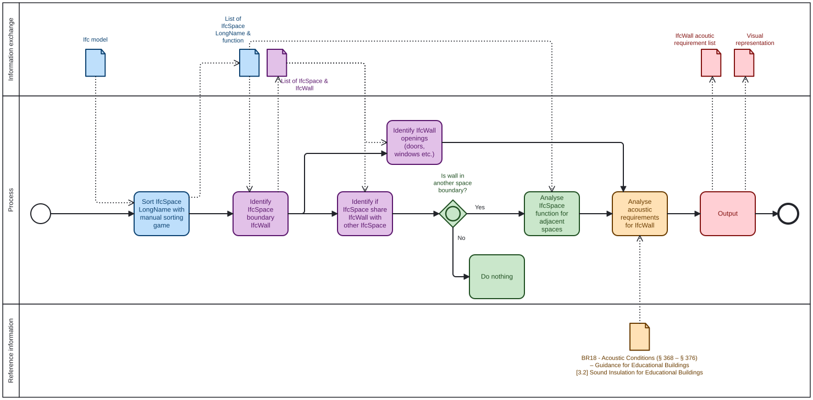

# A2a - About your group
“I am confident coding in Python”
- s263857: 0 - strongly disagree
- s215300: 3 - Agree
- s223468: 3 - Agree

We’re group 13 and since we’re only 3 persons in the entire subject of “Indoor & Energy / Acoustic / Daylight”, we choose to be analysts. We focus on building acoustics and more specifically sound transmission through interior walls.

# A2b - Identify Claim

## Selected building(s)

We focus on building 2601, but the tool should work on all of the buildings.

## “Claim” / issue to investigate

The designers of the building claim that the current internal separating walls, in the IFC-model, comply with the acoustic requirements of BR18 §368 - §376 for sound transmission between rooms.

## Description and justification of the claim

We aim to label/categorize the internal separating walls of the building, based on the required level of sound transmission insulation following BR18 §368 - §376. Here, numerous rules for the required sound insulation are specified depending on the rooms’ functions and whether there are doors or other openings/penetrations in the walls (e.g. ducts).

As an example, two adjacent rooms are considered in Figure 1. If rooms A and B are both classrooms, the sound insulation of the blue separating wall should be R'w ≥ 48 dB. However, if A is a classroom and B is a common area (e.g. hallway) or carpentry class, R'w ≥ 60 dB is required. Furthermore, if the wall also contains a door then the total sound insulation of the wall should be R'w ≥ 44 dB.

Thus, manually assigning the correct sound insulation requirement to every internal wall can be a repetitive and time-consuming process. It will therefore be useful to automate this process, to support acoustic design and provide a more consistent basis for wall construction design.

Note that, the purpose of the tool is not to calculate the actual sound insulation performance of a wall based on its assigned materials within Revit. Instead, it determines the required sound insulation level based on the context of the wall, and assigns this requirement as a classification or label. The subsequent design of a wall construction that meets this requirement is currently outside the scope of this project.

# A2c - Use Case

## How would you check this claim?

A secondary functional checker is implemented upon the primary tool that applies material identification and insulation calculation that can be compared to the regulatory requirement, labeled to the wall. This challenges the models’ original walls, whether they are sufficiently up to code or not.

The secondary tool is a necessary script that answers a specific question: does the model offer sufficient data that can be modeled and calculated, and if it does, does it claim to have the correct properties to create enough insulation between the rooms function that is approved by a regulatory system.

## When would this claim need to be checked?

During the planning and design process, when room functions, adjacencies and wall requirements are being established. The tool can also be used if room functions and adjacencies are significantly changed in the design process.

## What information does this claim rely on?

Room functions, room adjacency, wall locations, and the presence of doors or other openings/penetrations, together with the acoustic requirements in BR18 §368 - §376.

## Relevant phase planning, design, build or operation

Planning and design phase, because the early arrangement of room functions and adjacencies can influence the required sound insulation and vice versa. The actual wall classification is carried out once the spatial layout is more defined during design.

## Required BIM purpose

**Generate and gather**

The tool analyses room functions, adjacencies and wall openings against the BR18 §368 - §376 requirements to determine the required sound insulation, and then generates/assigns the corresponding wall classification or label.

## Relevant Penn State BIM use case

The closest existing BIM use case is **“Code Validation”**, since our tool uses information from the BIM model together with the requirements of BR18. However, the tool does not check whether an already designed wall complies with the regulation. Instead, it determines the acoustic requirement of the wall based on the context (room functions, adjacencies and openings) and assigns this requirement to the wall.

The tool therefore also shares some characteristics with **“Engineering Analysis”** (IBIMD Project BIM use 8), as it performs a discipline-specific acoustic assessment, and **“Design Authoring”**, since new information is added to the wall elements in the model.

For this reason, the use case of our tool could be more accurately described as **“Acoustic Requirement Classification”**.

## BPMN-diagram for the use case

Since the wall is a multidisciplinary building element, it is required to assess results from other disciplines, especially Materials. This is marked in the BPMN-diagram with green.

# A2d - Scope the use case

A new tool is needed to label the interior separating walls accordingly with the sound insulation requirements in BR18 §368 - §376. This part of the BPMN-diagram is highlighted in yellow.

# A2e - Tool Idea

## Goal

To tell a design team what sound insulation BR18 requires of every internal wall in their building, while also being able to identify the lack of information to model and label an answer properly.

## Tool capability

### Identify the rooms

The tools should be able to identify a space and formulate its function based on certain attributes and relations. It should be able to do this without a categorized or labeled room.

### Identify the separations

For each pair of neighbouring rooms, collect every element standing between them. Elements such as walls, glazed panel, door, folding wall.

BR18s’ regulations ask for the distinct characteristics between the separators of the two rooms. So the unit of analysis is the room part and its separation set, not a “wall”.

### Regulatory visibility

A script may be able to extract a possible external rule file (CSV) that holds the BR18 guidance values. The rulebook is data, not code, so it can be replaced for another building type or another country without touching the tool.

The file should be able to key the room category and by whether the separation contains a door or movable wall.

### Report and write back

Each separation (wall) gets its required R’w written to the IFC as a property set, and is coloured in Blender by a requirement category. A report can list the requirements, the open question and contradictions found.

## The core problem: identification

The tool has to work on a model it has never seen, so it cannot assume the room names are present, in English, in documentation, or correct.

It therefore must indicate at least three states of information:

- Identified
- Ambiguous
- Unknown

# A2f - Information Requirements

What the tool needs in, and gives out, to label a wall under BR18. The identification step drives the input list. The tool needs enough to identify the wall and both of its neighbours.

## Inputs required

- **Element geometry:** wall boundaries, thickness, height; enough to confirm it is a separating element and not a slab or object.

- **The two bounded spaces:** which space lies on each side of the wall. This is the critical input; the requirement is a function of the pair, not the wall.

- **Space use / occupancy type:** habitable room, stairwell, corridor, technical space, and which dwelling/unit each belongs to, inferred where labels are absent.

- **Topology:** the room-to-room adjacency and access graph, used to establish unit boundaries and separate "same unit" from "different unit".

- **Openings:** doors vs windows in the wall, since an opening changes both identity (circulation link) and the achievable acoustic performance.

- **Construction / material, if present:** build-up or an R′w value, used for the compliance check; not required for identification.

## Explicitly not relied on

- **Element and room name labels:** used as a hint if present, but the tool must not depend on them; that is the whole point of the identification step.

## Outputs produced

- Each wall is labelled with its BR18 acoustic requirement, including the required class/value and the separation case it was derived from.

- A confidence score and the evidence for each identification.

- A flag list containing:
  - Non-compliant walls
  - Walls the tool could not identify with enough confidence and which are therefore routed to a human

# A2g - Identify appropriate software licence

## Software licence

**GPL-3.0**
